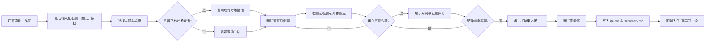

# interview-dsh

> 八股专项模拟面试插件 —— 在 DeepSeek Harness（DSH）里开卷陪练，不离开编码环境。

[](#)
[](#)
[](#)

## 这是什么？

`interview-dsh` 是一个跑在 DeepSeek Harness（DSH）上的**八股专项陪练插件**。候选人已经在 DSH 里写代码、对话、选模型，他们不需要为了练八股再开一个独立聊天产品，也不希望面试官、标准答案和评分挤在同一段气泡里。

**产品形态**：

| 位置 | 角色 | 用户感知 |
|---|---|---|
| 本场考场对话（项目下新开的 DSH 会话） | 面试官 | 提问、追问、提示、换题、结束 |
| 右侧插件面板 | 教练 | 开始一场练习、看开卷要点、看对照与五维、左右切回已答卡 |

插件不提供独立聊天页。说话只发生在 DSH 原对话里，但**考场不是用户正在写代码的那条对话**：从某个项目页点开始后，插件在该项目分组下新开一场面试官会话。这是开卷陪练，不是闭卷考场。

当前产品方向只做**八股专项**。具体能力与验收以 `openspec/specs/` 及对应 OpenSpec change 为准。

## 产品使用流程



### 流程说明

1. **开考**：候选人在项目工作区点击「面试」按钮，选择主题与难度。插件新开考场对话，面试官开口出题。
2. **作答**：候选人在考场对话回答；右侧面板实时展示开卷要点。作答后立刻给出本题对照与五维评分。
3. **回顾**：已答卡片保留原题、作答、对照与五维，可左右滑动切回查看。
4. **结束**：点击「结束本场」后，面试官用固定收尾句结束本轮，工作区留下逐题卡片、问答汇总与总结。同一条考场对话可再开一轮。

## 核心特性

- **不离开编码环境**：考场会话挂在项目分组下，不干扰正在写代码的对话。
- **双会话隔离**：左边被面试，右边看教练；评分和标准答提示词不会出现在考场对话里。
- **卡片化学习**：按题展示，左右滑动切题，已答卡可随时回看。
- **开卷陪练**：每题展示开卷要点，作答后立刻对照与五维评分。
- **本地留档**：问答与总结写入工作区 `.dsh-interview/` 目录，可导入笔记库。

## 安装与使用

### 用户侧安装

本仓库以 **DSH 插件 bundle** 的形式分发。安装入口在 DSH 侧。

1. 在 DSH 的插件配置或插件市场里，将本仓库作为 bundle 引入。
2. 插件生效后，对话输入框右侧会出现「面试」按钮；点击后展开右侧面板。
3. 选择主题与难度后即可开始练习。

> 详细技术安装步骤见下方 [开发者安装](#开发者安装)。

### 开发者安装

```bash
# 克隆仓库
git clone https://github.com/xerina/interview-dsh.git
cd interview-dsh

# 安装依赖
npm install

# 构建前后端
npm run build

# 运行测试
npm test

# 代码检查
npm run lint
```

构建产物位于：
- `backend/dist/` —— Host 入口
- `frontend/dist/client.js` —— Client 面板入口（样式内联进该文件，DSH 只加载此文件）

本地开发完成后，通过 DSH 的插件配置引入本仓库路径即可加载。

## 项目结构

```
backend/     TypeScript：用例入口、领域服务、落盘、DSH Host 适配
frontend/    React 面板；DSH Web Client 适配在 src/infra/dsh/
shared/     前后端共享类型与错误码，无业务逻辑
cordis.patch.yml / 根 package.json 的 dsh.bundle  组合包清单
docs/
  product/REQUIREMENTS.md   产品定位与使用者
  architecture/ARCHITECTURE.md  架构设计与编码规范
openspec/    主规格与 change（进行中的在 changes/，已交付的在 changes/archive/）
interviewer-role-prompt.md  面试官内容口径
doc/         UI 参考图
```

## 架构总览

本仓库是 **DSH 插件**，不是独立应用。

```
DSH Web
  考场对话  = 面试官说话的唯一表面（项目下新开的宿主会话）
  右侧面板  = 本仓库前端（入口 + 逐题卡片）
       |
       v
  插件后端  = 提示词注入、双会话、评分、落盘
```

关键约束：

- 对话 UI、输入框、模型配置由 DSH 提供。
- 插件前端只做面板；`frontend/src/features/` 不得出现消息列表、输入框、气泡。
- 插件后端通过官方生命周期接入。
- Host SDK 只出现在 `backend/src/infra/dsh/`；Web Client SDK 只出现在 `frontend/src/infra/dsh/`。
- 跨端只通过 `shared/` 沟通，禁止 `fetch('/api/...')`。

## 核心流程

1. **开考**：Client 展开面板，按当前项目解析工作区后 `sessions.create` → Host `attachInterviewer` → `session.prompt` 只开口一次 → `sessions.open` → Host `briefCoach` 写出 `Q1`。
2. **作答**：候选人在考场对话回答；插件看守：新作答则本题对照与五维，新待答问则追加卡片。
3. **结束**：面板「结束本场」停看守、短句收尾、写本轮 `qa.md` 与 `summary.md`，回到入口；不切换宿主当前会话，不摘人设。新一轮可复用同一条考场对话。

会话隔离：

- 会话 A（新开的考场对话，挂在当前项目分组）：面试官提问、追问、提示、换题。不读场前历史；不得看见评分/标准答提示词。
- 会话 B（右侧面板）：教练展示开卷要点、对照、五维与可切回的逐题卡。不得任何输出进入气泡；不得读场前历史。

## 会话隔离与数据流

| 会话 | 角色 | 架构禁止 |
|---|---|---|
| A 对话 / 面试官 | 提问、追问、提示、换题 | 读场前历史；看见评分/标准答提示词；领域层直接调 Host SDK |
| B 面板 / 教练 | 展示开卷要点、对照、五维、卡片流 | 任何输出进入气泡；读场前历史；前端做评分判定 |

允许：A 的问答作为材料单向交给 B。禁止：B 回流到 A。第一问之后的追问由宿主对话继续；插件只看守抽出后的当前待答问并刷新面板，追问阶段不得再向 A `prompt`。结束本轮允许且仅允许那一次收尾 `prompt`，可见正文为「结束面试」。

## 工作区写入

文件系统只走 Host `ctx.fs`：先 `ctx.fs.resolve(rel, { cwd })` 得到 FsTarget 再写，并带工作区写入策略。禁止 `node:fs`，不得把路径字符串直接传给 `writeText`。

工作区根是考场会话 `header.cwd`；相对路径为 `.dsh-interview/<考场 sessionId>/round-<n>-<slug>/`（`session.json`、`cards/<id>.md`、结束时的 `qa.md` 与 `summary.md`），会话根另写 `index.json`（`in_progress` | `ended`）。

## 插件注册信息

插件生效后，注册的 Slot 为：

| Slot | id | 作用 |
|---|---|---|
| `conversation.input.right` | `interview-dsh` | 主触发按钮 |
| `shell.overlay` | `interview-dsh/entry-overlay` | 回退面板 / 打开失败的可见错误层 |

## 贡献指南

欢迎贡献！我们鼓励社区成员提交 PR 来改进这个项目。

### 如何贡献

1. Fork 本仓库
2. 创建你的特性分支 (`git checkout -b feature/amazing-feature`)
3. 提交你的修改 (`git commit -m 'feat: add amazing feature'`)
4. 推送到分支 (`git push origin feature/amazing-feature`)
5. 开启一个 Pull Request

### 贡献前请阅读

- [AGENTS.md](AGENTS.md) - 项目级代理约束与开发准则
- [docs/architecture/ARCHITECTURE.md](docs/architecture/ARCHITECTURE.md) - 架构设计与编码规范
- [docs/product/REQUIREMENTS.md](docs/product/REQUIREMENTS.md) - 产品定位与使用者
- [docs/FORBIDDEN.md](docs/FORBIDDEN.md) - 已否决的做法与错误边界

### 开发约定

- 提交信息使用 [Conventional Commits](https://www.conventionalcommits.org/)。
- 功能必须拆成可独立验证的小步；先最小可演示，再补后续能力。
- 分层与目录结构必须遵守架构文档；新文件必须落到对应目录。
- 禁止把本机 Desktop 安装目录写进仓库。
- 发现架构文档与实现冲突时，先改架构并说明原因，不得自行绕过。

## 参考文档

| 文件 | 内容 |
|---|---|
| `AGENTS.md` | 项目级代理约束与开发准则 |
| `docs/architecture/ARCHITECTURE.md` | 架构设计与编码规范 |
| `docs/product/REQUIREMENTS.md` | 产品定位与使用者 |
| `openspec/changes/` | 当前能力的实现 change |
| `interviewer-role-prompt.md` | 面试官内容口径 |
| `doc/entrance.png` / `doc/layout.png` / `docs/product-design/` | UI 参考（入口与进行中产品图） |

## 许可证

MIT

---

Made with ❤️ by [xerina](https://github.com/xerina)
