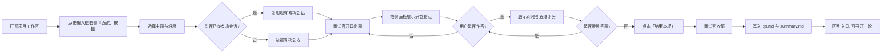

# interview-dsh

> 八股专项模拟面试插件 —— 在 DeepSeek Harness（DSH）里开卷陪练，不离开编码环境。

[](https://dsh.pub/zh/plugins/interview-dsh/)
[](https://dsh.pub/zh/plugins/interview-dsh/)
[](#本地开发)
[](#许可证)

<p align="center">
  
</p>

<p align="center"><strong>你的 AI 面试陪练搭子 · 刷八股 · 问不倒 · 拿 Offer</strong></p>

面试八股插件跑在 DeepSeek Harness（DSH）上，覆盖 Java、MySQL、Redis、消息队列、系统设计等常见八股主题。候选人已经在 DSH 里写代码、对话、选模型，练八股不必再开一个独立聊天产品。

**左边被面，右边看教练。** 说话只发生在 DSH 原对话里；评分、开卷要点和标准答提示词留在右侧卡片。这是开卷陪练，不是闭卷考场。

## 快速安装

把插件装进 Desktop 正在使用的 profile（一般是 `web`）。下面这条钉死当前可安装 commit：

```bash
npx dshpub add jiangnuonnuo/interview-dsh-plugin --ref 5c97af374752ef87bef27f498359f777c8bf8242 --profile web
```

等价：

```bash
dsh plugin --profile web add github:jiangnuonnuo/interview-dsh-plugin#5c97af374752ef87bef27f498359f777c8bf8242
```

安装后**完全退出并重启 DSH Desktop**。输入栏右侧「AI 优化」旁出现「面试」才算装上。不要 `git clone` 再本地 `npm run build` 来当普通安装步骤。

已收录：[dsh.pub 目录页](https://dsh.pub/zh/plugins/interview-dsh/)。目录页可能钉的是首发 commit；要装本版请用上面这条命令。大版本怎么发、升级命令见 [`docs/product/DISTRIBUTION.md`](docs/product/DISTRIBUTION.md)。

卸载：

```bash
dsh plugin --profile web remove interview-dsh
```

已装用户升级：先 `remove`，再执行上面的 `npx dshpub add …`，然后重启 Desktop。

## 这是什么？

`interview-dsh` 是跑在 DeepSeek Harness（DSH）上的**八股专项陪练插件**。

| 位置 | 角色 | 用户感知 |
|---|---|---|
| 本场考场对话（项目下新开的 DSH 会话） | 面试官 | 提问、追问、提示、换题、结束 |
| 右侧插件面板 | 教练 | 开始一场练习、看开卷要点、看对照与五维、左右切回已答卡 |

插件不提供独立聊天页。说话只发生在 DSH 原对话里，但**考场不是用户正在写代码的那条对话**：从某个项目页点开始后，插件在该项目分组下新开一场面试官会话。

当前产品方向只做**八股专项**。具体能力与验收以 [`openspec/specs/`](openspec/specs/) 及对应 OpenSpec change 为准。

## 怎么用



1. **开考**：在项目工作区点输入栏「面试」，选择主题与难度。插件新开（或复用）考场对话，面试官开口出题。
2. **作答**：在考场对话里回答；右侧面板实时展示开卷要点。交卷后立刻给出本题对照与五维评分。
3. **回顾**：已答卡片保留原题、作答、对照与五维，可左右滑动切回查看。
4. **结束**：点「结束本场」后面试官用固定收尾句结束本轮，工作区留下逐题卡片、问答汇总与总结。同一条考场对话可再开一轮。

## 核心优势

- **覆盖常见八股主题**：Java、MySQL、Redis、消息队列、分布式系统设计等，面试官按主题动态出题，不靠内置死题库。
- **对话里模拟面试**：考场会话里提问、追问、换题、结束，还原多轮技术面。
- **知识卡片对照**：题目一出现就有开卷要点；作答后立刻给出本题对照与五维评分，可左右滑动回看。
- **一条命令安装**：钉死 commit，重启 Desktop 后输入栏右侧出现「面试」。

工作方式：考场会话挂在项目分组下，不干扰正在写代码的对话；评分提示词不进气泡；本轮 `qa.md` 与 `summary.md` 写入工作区 `.dsh-interview/`，可导入笔记库。

## 更新日志

### 1.0.1

- **新增**：卡片流「正在生成」状态提醒 —— 新题出现后，旧卡保留并展示生成中状态，避免重复出题或状态丢失。
- **测试补充**：`InProgressPanel` 与 `card-view` 单测覆盖生成态分支。

## 产品界面

宣传海报见文首。下面是教练面板在 DSH 里的主路径状态：

| 状态 | 说明 | 预览 |
|---|---|---|
| 入口待开考 | 选题与难度；xerina 头像与署名 |  |
| 卡片流态 | 面试进行中，左右滑动快速切题 |  |
| 完整详情态 | 点击当前卡后查看完整题干与分区内容 |  |
| 实时更新态 | 新题出现后，旧卡保留并展示生成中状态 |  |
| 开始中 | 正在初始化面试官会话 |  |
| 结束回入口 | 本轮结束，可再开一轮 |  |
| 打开失败 | 回退面板 / 可见错误层 |  |

## 开发约定

- 本仓库是 **DSH 插件**，不是独立应用。功能通过 OpenSpec change 推进，当前能力与验收以 `openspec/specs/` 为准。
- 提交信息使用 [Conventional Commits](https://www.conventionalcommits.org/)。
- 功能必须拆成可独立验证的小步；先最小可演示，再补后续能力。
- 分层与目录结构必须遵守架构文档；新文件必须落到对应目录。
- 发现架构文档与实现冲突时，先改架构并说明原因，不得自行绕过。
- 禁止把本机 Desktop 安装目录写进仓库。

## 本地开发

```bash
git clone https://github.com/jiangnuonnuo/interview-dsh-plugin.git
cd interview-dsh-plugin
npm install
npm run build
dsh plugin --profile web add ./
```

`npm run build` 会构建 workspaces 并把安装器用的 `lib/` 写好。改 Host/Client 后要再跑一遍，否则 Desktop 仍加载旧的 `lib/`。

## 贡献指南

欢迎提交 PR。

1. Fork 本仓库
2. 创建特性分支 (`git checkout -b feature/amazing-feature`)
3. 提交修改 (`git commit -m 'feat: add amazing feature'`)
4. 推送到分支 (`git push origin feature/amazing-feature`)
5. 开启 Pull Request

本项目的功能迭代通过 [OpenSpec](openspec/config.yaml) 管理。提交 PR 前，请确认对应的 OpenSpec change 已存在或同步开启；实现只对应当前 change 的 spec / design / tasks。

## 参考文档

| 文件 | 内容 |
|---|---|
| [`AGENTS.md`](AGENTS.md) | 项目级代理约束与开发准则 |
| [`docs/architecture/ARCHITECTURE.md`](docs/architecture/ARCHITECTURE.md) | 架构设计与编码规范 |
| [`docs/product/REQUIREMENTS.md`](docs/product/REQUIREMENTS.md) | 产品定位与使用者 |
| [`docs/product/DISTRIBUTION.md`](docs/product/DISTRIBUTION.md) | 对外发版与安装 SHA |
| [`openspec/specs/`](openspec/specs/) | 当前已落地能力 |
| [`interviewer-role-prompt.md`](interviewer-role-prompt.md) | 面试官内容口径 |
| [`docs/product-design/`](docs/product-design/) | 教练面板界面参考图 |
| [`doc/sum.png`](doc/sum.png) | 产品宣传图 |

## 许可证

MIT

---

Made with ❤️ by [xerina](https://github.com/xerina)
