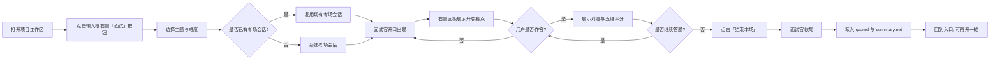
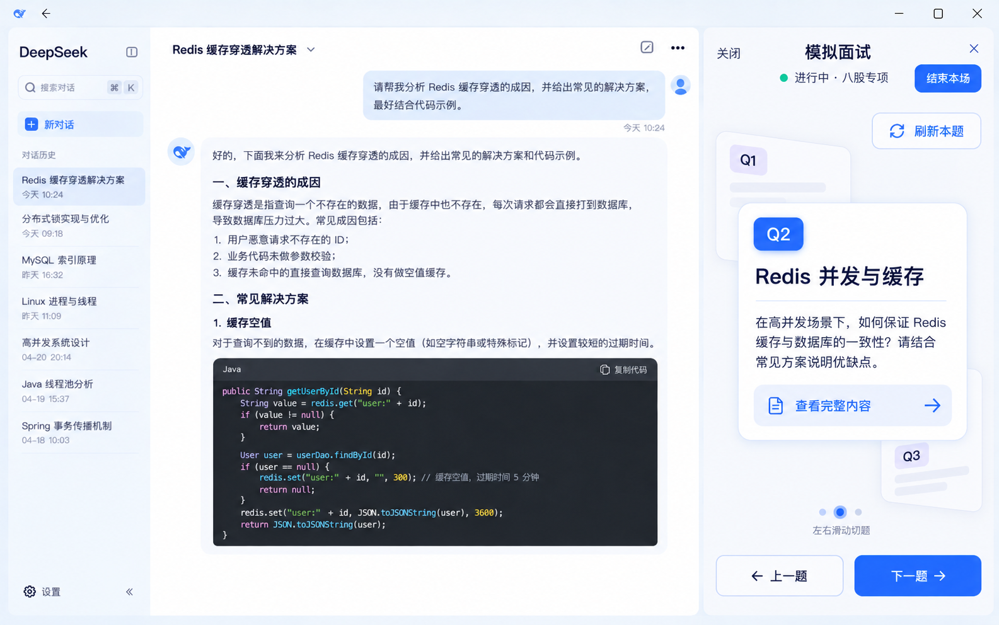
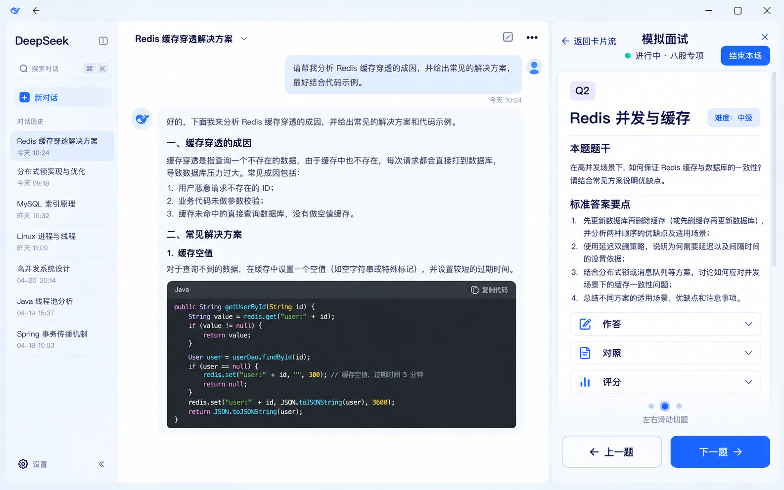
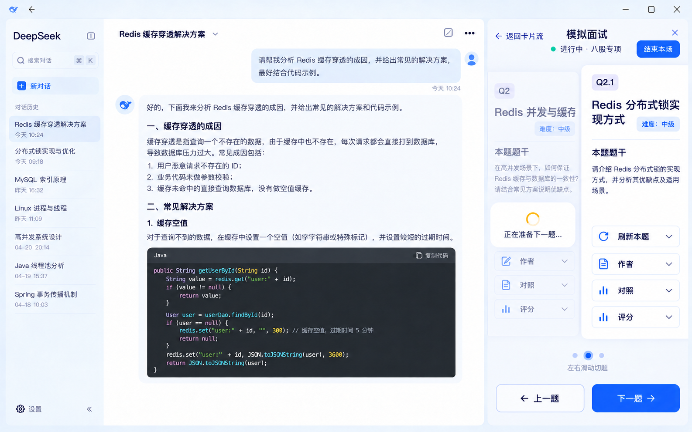
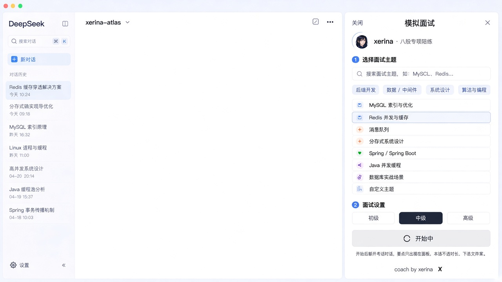
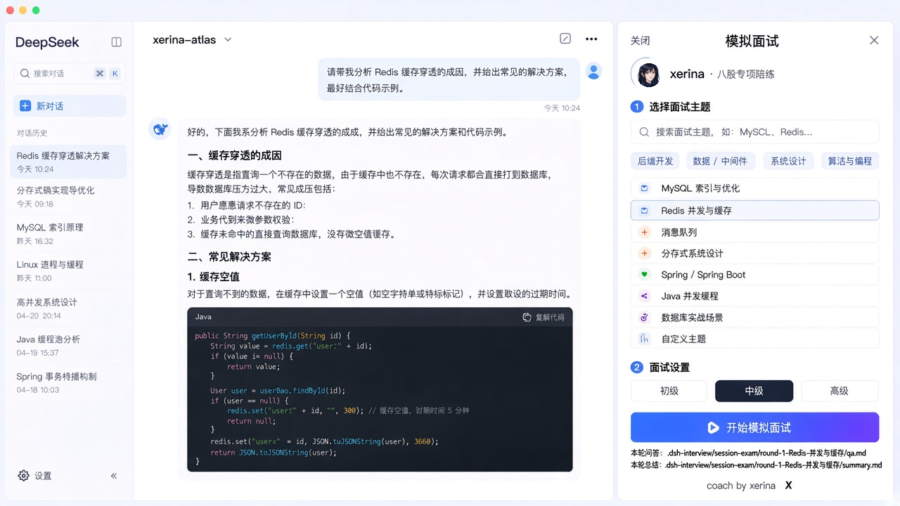
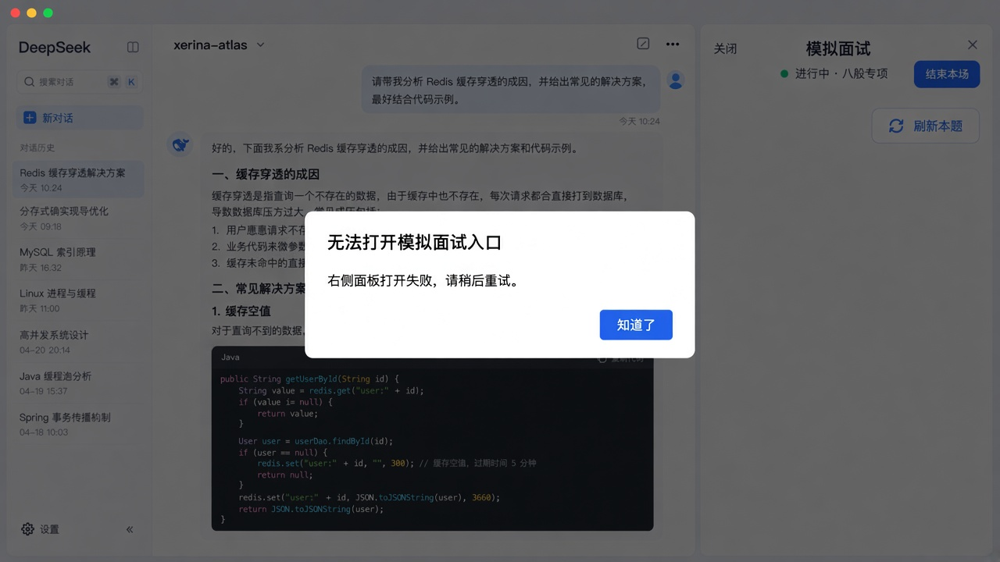

# interview-dsh

> 八股专项模拟面试插件 —— 在 DeepSeek Harness（DSH）里开卷陪练，不离开编码环境。

[](#)
[](#)
[](#)

## 这是什么？

`interview-dsh` 是一个跑在 DeepSeek Harness（DSH）上的**八股专项陪练插件**。候选人已经在 DSH 里写代码、对话、选模型，他们不需要为了练八股再开一个独立聊天产品，也不希望面试官、标准答案和评分挤在同一段气泡里。

**产品形态**：

| 位置 | 角色 | 用户感知 |
|---|---|---|
| 本场考场对话（项目下新开的 DSH 会话） | 面试官 | 提问、追问、提示、换题、结束 |
| 右侧插件面板 | 教练 | 开始一场练习、看开卷要点、看对照与五维、左右切回已答卡 |

插件不提供独立聊天页。说话只发生在 DSH 原对话里，但**考场不是用户正在写代码的那条对话**：从某个项目页点开始后，插件在该项目分组下新开一场面试官会话。这是开卷陪练，不是闭卷考场。

当前产品方向只做**八股专项**。具体能力与验收以 `openspec/specs/` 及对应 OpenSpec change 为准。

## 产品使用流程



1. **开考**：候选人在项目工作区点击「面试」按钮，选择主题与难度。插件新开考场对话，面试官开口出题。
2. **作答**：候选人在考场对话回答；右侧面板实时展示开卷要点。作答后立刻给出本题对照与五维评分。
3. **回顾**：已答卡片保留原题、作答、对照与五维，可左右滑动切回查看。
4. **结束**：点击「结束本场」后，面试官用固定收尾句结束本轮，工作区留下逐题卡片、问答汇总与总结。同一条考场对话可再开一轮。

## 核心特性

- **不离开编码环境**：考场会话挂在项目分组下，不干扰正在写代码的对话。
- **双会话隔离**：左边被面试，右边看教练；评分和标准答提示词不会出现在考场对话里。
- **卡片化学习**：按题展示，左右滑动切题，已答卡可随时回看。
- **开卷陪练**：每题展示开卷要点，作答后立刻对照与五维评分。
- **本地留档**：问答与总结写入工作区 `.dsh-interview/` 目录，可导入笔记库。

## 产品界面

| 状态 | 说明 | 预览 |
|---|---|---|
| 入口待开考 | 选题与难度；xerina 头像与署名 |  |
| 卡片流态 | 面试进行中，左右滑动快速切题 |  |
| 完整详情态 | 点击当前卡后查看完整题干与分区内容 |  |
| 实时更新态 | 新题出现后，旧卡保留并展示生成中状态 |  |
| 开始中 | 正在初始化面试官会话 |  |
| 结束回入口 | 本轮结束，可再开一轮 |  |
| 打开失败 | 回退面板 / 可见错误层 |  |

## 快速开始

```bash
git clone https://github.com/xerina/interview-dsh.git
cd interview-dsh
npm install
npm run build
```

本地开发完成后，通过 DSH 的插件配置引入本仓库路径即可加载。

## 开发约定

- 本仓库是 **DSH 插件**，不是独立应用。功能通过 OpenSpec change 推进，当前能力与验收以 `openspec/specs/` 为准。
- 提交信息使用 [Conventional Commits](https://www.conventionalcommits.org/)。
- 功能必须拆成可独立验证的小步；先最小可演示，再补后续能力。
- 分层与目录结构必须遵守架构文档；新文件必须落到对应目录。
- 发现架构文档与实现冲突时，先改架构并说明原因，不得自行绕过。
- 禁止把本机 Desktop 安装目录写进仓库。

## 贡献指南

欢迎提交 PR！

1. Fork 本仓库
2. 创建特性分支 (`git checkout -b feature/amazing-feature`)
3. 提交修改 (`git commit -m 'feat: add amazing feature'`)
4. 推送到分支 (`git push origin feature/amazing-feature`)
5. 开启 Pull Request

**重要**：本项目的功能迭代通过 [OpenSpec](openspec/config.yaml) 管理。提交 PR 前，请确认对应的 OpenSpec change 已存在或同步开启；实现只对应当前 change 的 spec / design / tasks。

## 参考文档

| 文件 | 内容 |
|---|---|
| `AGENTS.md` | 项目级代理约束与开发准则 |
| `docs/architecture/ARCHITECTURE.md` | 架构设计与编码规范 |
| `docs/product/REQUIREMENTS.md` | 产品定位与使用者 |
| `openspec/changes/` | 当前能力的实现 change |
| `interviewer-role-prompt.md` | 面试官内容口径 |
| `docs/product-design/` | 产品界面参考图 |

## 许可证

MIT

---

Made with ❤️ by [xerina](https://github.com/xerina)
