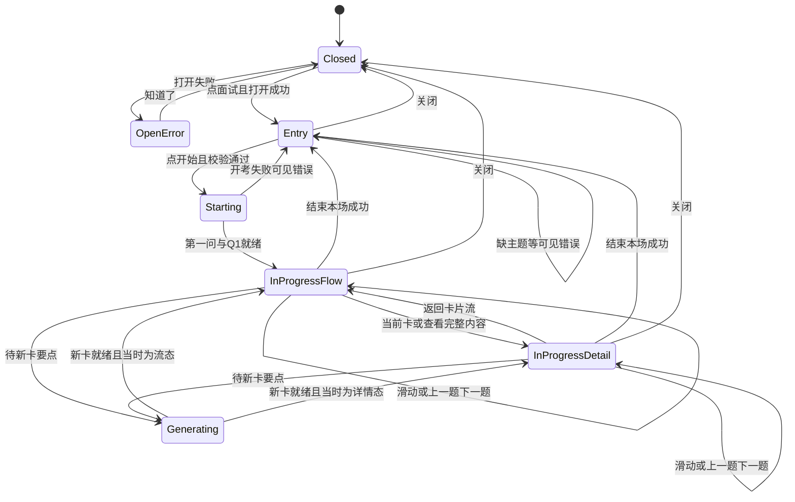

## Context

动机见 `proposal.md`。行为合同见本 change 的 `specs/`。

当前实现：`EntryPanel` 在无甲板时画入口；有甲板时整页换成 `InProgressPanel`。进行中是一次一张的纵向长页。入口仍是旧独立截图壳（`doc/entry-panel.png`），与进行中三张产品图不是同一套 DSH 构图。overlay 抽屉 `position: fixed; right: 0; width: min(360px, 100%); z-index: 1000`。

产品视觉真源（`docs/product-design/`）：

| 状态 | 文件 | 覆盖 |
|---|---|---|
| 头像 | `xerina-avatar.png` | 入口圆形裁剪真源 |
| 入口待开考 | `interview-panel-flat-entry.png` | P2 主路径；已圆形贴入 `xerina-avatar.png` |
| 自定义主题 | `interview-panel-flat-entry-custom.png` | P2 自定义输入 |
| 缺主题错误 | `interview-panel-flat-entry-error.png` | P12 入口校验 |
| 开始中 | `interview-panel-flat-starting.png` | P11 |
| 打开失败 | `interview-panel-flat-open-error.png` | P1 对话框「知道了」 |
| 首题单卡流 | `interview-panel-flat-card-flow-q1.png` | P3 无假邻卡 |
| 卡片流 | `interview-panel-flat-card-flow.png` | P3 / P6 / P7 / P9 |
| 待答详情 | `interview-panel-flat-detail.png` | P4 折叠区 |
| 已评详情 | `interview-panel-flat-detail-scored.png` | P8 作答/对照/五维展开 |
| 生成中 | `interview-panel-flat-live-update.png` | P5 |
| 进行中错误 | `interview-panel-flat-error.png` | P12 错误条 + 甲板仍在 |
| 结束回入口 | `interview-panel-flat-round-ended.png` | P10 路径 hint |

`doc/entry-panel.png` 只作历史稿。`doc/entrance.png` 仍说明 P0 输入栏位置。产品图若出现错字，功能文案以 spec 清单为准。P13 重开 overlay 复用卡片流图。

约束不变：面板不是聊天；Host SDK 不进 `features/`；前端不算分；CSS Modules，不引入 UI 库；滑动不得拆掉 `fixed` overlay。

## Goals / Non-Goals

**Goals:**

- 把进行中表面改成流态 / 详情态 / 生成中占位，结构对齐三张进行中产品图。
- 把入口壳改到与上述图同一套 DSH 右侧面板语言，并露出 **xerina** 署名。
- 用一份 UI 状态图覆盖**已有功能点**，前端按图实现，不靠猜。
- 切卡、进详情、生成中占位、入口换肤只改前端呈现；甲板契约、看守、落盘、结束本轮、主题清单保持现有端口。

**Non-Goals:**

- 不改预设主题名、难度三档、开始校验。
- 不新增 `title` 到 `QuestionCard`（短标题前端从 `questionBrief` 截断）。
- 不引入手势库、轮播库、Tailwind。
- 不把生成中写成落盘卡，不增加聊天、计时器、提示/跳过、手册预览。
- 不把 xerina 做成可点的外链、人设聊天或运营后台。
- 分层不变则不改 `ARCHITECTURE.md`。`REQUIREMENTS.md` 3.1 只补入口图与署名，不改卡片化规则。

## 全功能 UI 地图（前端实现真源）

下面按用户能看见的表面列出**全部已有功能点**。本刀视觉改造的是 P2–P5；P2 换壳与署名，不改选题信息架构。



### 功能点 × 表面

| ID | 功能点 | 表面 | 本刀动作 | 参考 |
|---|---|---|---|---|
| P0 | 输入栏「面试」 | 宿主 composer 右槽 | 不改 | `doc/entrance.png` |
| P1 | 打开失败 | overlay 错误对话框 | 文案与「知道了」不变；视觉对照新图 | `interview-panel-flat-open-error.png` |
| P2 | 入口：搜主题、分类、预设、自定义、难度、开始 | 入口面板 | **换壳 + xerina 头像署名** | `interview-panel-flat-entry.png`；自定义 `…-entry-custom.png` |
| P3 | 进行中卡片流 | 进行中 / 流态 | **重做** | `interview-panel-flat-card-flow.png`；首题 `…-card-flow-q1.png` |
| P4 | 完整详情 | 进行中 / 详情态 | **重做** | `interview-panel-flat-detail.png` |
| P5 | 新题生成中 | 流态或详情上的占位 | **新增可见占位** | `interview-panel-flat-live-update.png` |
| P6 | 刷新本题 | 流态舞台右上 + 详情卡内 | 换位置，行为不变 | 流态图 / 生成中图 |
| P7 | 结束本场 | 进行中顶栏 | 换到状态行右侧，行为不变 | 三张进行中图 |
| P8 | 交卷后对照与五维 | 详情折叠区展开 | 从长页改为折叠，数据只读后端 | `interview-panel-flat-detail-scored.png` |
| P9 | 切回已评卡 | 流态滑动/按钮；详情内切题 | **滑动必达** | 流态图 |
| P10 | 结束成功 | 回到入口，展示路径 | 换壳后仍只展示路径，不做预览 | `interview-panel-flat-round-ended.png` |
| P11 | 开始中 | 入口 CTA 禁用 | 按钮不可重复点 | `interview-panel-flat-starting.png` |
| P12 | 可见失败 | 入口红字或进行中错误条 | 不得空 catch、不得清空甲板 | 入口 `…-entry-error.png`；进行中 `…-error.png` |
| P13 | overlay 重开恢复进行中甲板 | 直接进流态，默认最新卡 | 恢复后默认流态 | 复用卡片流图 |
| P14 | 禁止项 | 全表面 | 无聊天、无提示/跳过、无时长、无选文件夹、无场级仪表盘 | `REQUIREMENTS.md` 3.1 |

### P2 入口线框

```text
┌ 关闭          模拟面试            × ┐
│ [头像] xerina · 八股专项陪练          │
│ ① 选择面试主题                       │
│ [搜索]  分类 chips  主题列表  自定义 │
│ ② 面试设置  初/中/高                 │
│ (错误) (qa.md 路径) (summary.md 路径)│
│ [▶ 开始模拟面试]                     │
│ 开始后新开考场对话；不选时长/文件夹   │
│              coach by xerina         │
└────────────────────────────────────┘
```

顶栏与进行中相同：左「关闭」、中「模拟面试」、右「×」。标题旁圆形动漫头像（`docs/product-design/xerina-avatar.png`）+ 副标题是个人品牌，不是第二套产品名。主题清单与现实现一致，不按产品图 OCR。进行中三张图不再重复署名，以免挤状态行；推广落在入口第一眼。

### P3 卡片流线框

```text
┌ 关闭          模拟面试            × ┐
│ ● 进行中 · 八股专项     [结束本场]  │
│                          [刷新本题] │
│      ╭Q1╮                           │
│   ╭──┤  ├──╮                        │
│   │Q2 标题  │← 当前卡               │
│   │题干摘要  │                       │
│   │[查看完整内容 →]│                 │
│   ╰──┤  ├──╯                        │
│      ╰Q3╯                           │
│           ● ○ ○   左右滑动切换       │
│ [← 上一题]              [下一题 →]  │
│ (错误条)                             │
└─────────────────────────────────────┘
```

当前卡：编号徽章、短标题、最多约 3 行题干摘要、「查看完整内容」。邻卡只露编号或局部。仅一张卡时不画虚假左右邻卡，对照 `interview-panel-flat-card-flow-q1.png`；多卡对照 `interview-panel-flat-card-flow.png`。点击当前卡主体或 CTA 进详情；点击邻卡局部 = 切到该卡（仍为流态）。

### P4 详情线框

```text
┌ ← 返回卡片流    模拟面试          × ┐
│ ● 进行中 · 八股专项     [结束本场]  │
│ Q2                                  │
│ 短标题                   难度：中级 │
│ 本题题干  （展开正文）              │
│ 标准答案要点（列表）                │
│ [作答 ▾]  [对照 ▾]  [评分 ▾]       │
│           ● ○ ○   左右滑动切换       │
│ [← 上一题]              [下一题 →]  │
│ (错误条)                             │
└─────────────────────────────────────┘
```

待答：三个分区可点开，内容为「待作答 / 待对照 / 五维 —」，对照 `interview-panel-flat-detail.png`。已评：点开后展示后端作答、覆盖/缺口/评语、五维数字，对照 `interview-panel-flat-detail-scored.png`。折叠控件用 `button` + `aria-expanded`，MUST NOT 用 HTML `<details>`。

### P5 生成中

不写入 `cards[]`。在甲板末尾（或当前最新卡侧）插入 UI 槽：转圈 + 「正在生成本题」或「正在准备下一题」。旧卡仍可切回。要点完成后槽消失，新卡成为当前；若当时是详情态，进入新卡详情。

触发（纯前端，不改 watch 契约）：

1. `refreshing === true`
2. 最新卡 `status === 'scored'`（等待下一问/下一张 pending 卡）
3. 看守返回失败但甲板仍在：只显示错误条，不假装生成成功

### 共用顶栏

| 控件 | 入口 | 流态 | 详情态 | 行为 |
|---|---|---|---|---|
| 关闭 | 左 | 左 | 无（改成返回） | `onClose`，关 overlay |
| 返回卡片流 | 无 | 无 | 左 | 回流态，不关面板 |
| 标题「模拟面试」 | 中 | 中 | 中 | 只读 |
| × | 右 | 右 | 右 | 与关闭相同 |
| xerina 动漫头像 + 副标题 | 标题下 | 无 | 无 | 只读署名；头像圆形裁剪，不可点 |
| 进行中 · 八股专项 | 无 | 状态行 | 状态行 | 圆点表示进行中 |
| 结束本场 | 无 | 状态行右 | 状态行右 | `onEnd`；结束中禁用 |
| 刷新本题 | 无 | 舞台右上 | 当前卡工具区 | `onRefresh`；刷新中禁用 |
| `coach by xerina` | 页脚 | 无 | 无 | 只读署名 |

主题名不必在流态另起一行；详情短标题来自本题 `questionBrief`。难度徽章用 `deck.difficulty`。

### 交互

- 向左滑 = 下一题，向右滑 = 上一题（与参考图「左右滑动切换」及产品文档一致）。
- 位移超过约 48px 且水平大于垂直才切卡；垂直滚动详情正文优先。
- 边界不循环。
- 滑动只绑舞台，MUST NOT 关闭 overlay、MUST NOT `preventDefault` 到宿主输入框。
- 分页点可点，点数 = `cards.length`（生成中 +1 不可点或点了仍停在最新真卡）。
- 新卡追加：跳到新卡。仅评分更新同一卡：不打断用户正在看的历史卡。
- overlay 重开：流态 + 最新卡。

### 视觉（从产品图收敛，CSS Modules）

- 面板底 `#f4f7fb` 或白底 + 浅灰舞台；当前卡白底、大圆角（~20px）、轻阴影。
- 当前卡编号徽章实心蓝；主按钮「下一题」实心蓝，白字；「上一题」白底描边。
- 「查看完整内容」浅蓝色块，非第三聊天入口。
- 进行中圆点绿。错误条保持现有红字 `role="alert"`。
- 抽屉宽度维持 `min(360px, 100%)`；流态用重叠与缩放做局部露出，不靠加宽宿主。

## Decisions

### 1. 进行中只改呈现；入口只换壳与署名

`InterviewDeck` / `QuestionCard` / `watchCoachTurn` / `endRound` / `startInterview` 保持。`viewCardId` + 本地 `viewMode: 'flow' | 'detail'` 存在 `InProgressPanel` 内。`EntryPanel` 仍按 `deck` 有无切换入口/进行中；本刀改它的顶栏、动漫头像、副标题、页脚与间距，不改 port。

备选：后端下发 `viewMode` — 否决，纯 UI。备选：给卡加 `title` — 推迟，截断 `questionBrief`（优先第一行，上限约 16 字）。

### 1.1 xerina 署名只出现在入口

副标题 `xerina · 八股专项陪练`、页脚 `coach by xerina`、圆形动漫头像放在待开考第一眼。头像真源 `docs/product-design/xerina-avatar.png`（深蓝发、银 X 发夹/耳环、藏青衬衫）。入口及相关状态产品图（待开考、自定义、缺主题、开始中、结束回入口）MUST 直接圆形裁剪贴入该文件，MUST NOT 再生成另一张脸。实现时拷入 `frontend` 静态资源并用 `img` + 圆形裁剪，MUST NOT 内联成几何 `x` 字标顶替。进行中状态行已有「八股专项」与结束/刷新，不再重复页脚或头像。头像与署名不可点击，不是聊天人设。

备选：几何 `x` 字标 — 否决，推广辨识度不够。备选：所有状态都打 xerina 水印 — 否决，挤卡片流。备选：可点外链主页 — 否决，插件内无运营页。

### 2. 生成中是前端槽，不是第三种 `CardStatus`

避免落盘出现「假卡」、避免结束时 `qa.md` 多出空节。最新卡已评即显示「正在准备下一题」，与产品「旧卡保留、生成中可见」一致；面试官尚未开口时也会看到占位，可接受。

备选：watch 增加 `briefing` — 本刀不改后端。备选：答完立刻占位，不等等分 — 否决，评分仍要停在本题。

### 3. 手势用指针事件，不引库

`pointerdown/move/up`（加 `pointercancel`）做水平判定。不使用 3D transform 轮播。邻卡 `scale` + `translateX` + 降低透明度。

备选：CSS `scroll-snap` — 易和 overlay 抢滚动，且「局部露出」不好做，否决。

### 4. 文件拆分保持 feature 内聚

`frontend/src/features/session/`：`InProgressPanel.tsx` 壳；同目录拆 `CardFlowStage`、`CardDetail`、`CardNav`（可同文件也可分子文件）。样式继续 `InProgressPanel.module.css`（或按子组件拆 module）。禁止 `features/` import Client SDK。

### 5. 测试先锁行为再改视觉

更新 `InProgressPanel.test.tsx`：流态默认不把要点长列表当唯一布局；详情才出现「本题题干」「标准答要点」；`data-testid` 保留 `interview-in-progress`、`card-id`、`prev-card`、`next-card`、`refresh-coach`、`end-exam`、`card-answer`、`card-comparison`、`score-placeholders`，并新增 `card-flow`、`card-detail`、`open-card-detail`、`back-to-flow`、`generating-next`。`EntryPanel.test.tsx` 断言可见 `xerina · 八股专项陪练` 与 `coach by xerina`，以及头像 `img`；主题/难度/开始仍在，无时长。`EntryPanel.watch.test.tsx` 切卡仍点 `prev-card`，必要时先 `open-card-detail` 再断言对照。TDD：先改测试为失败，再改实现。

## Risks / Trade-offs

- [Risk] 360px 抽屉里三张卡重叠过挤 → 邻卡只露 16–28px；单卡时不画假邻卡。
- [Risk] 滑动误关 overlay 或误触宿主 → 事件停在舞台；overlay 继续 `fixed`。
- [Risk] 已评后一直显示生成中、用户以为卡死 → 文案是「正在准备下一题」；结束本场仍可用；看守失败用错误条。
- [Risk] 新卡到达把用户从历史卡拽走 → 与产品「自动定位到最新卡」一致，只在 `cards` 增员时跳。
- [Risk] 详情折叠让人以为没有要点 → 题干与要点默认展开；只折叠作答/对照/评分。
- [Trade-off] 不改后端 briefing 信号 → 实现快，占位可能略早于面试官开口。
- [Trade-off] xerina 只打在入口 → 第一眼能推广，进行中保持既有三张图的密度。

## Migration Plan

- 重载插件即可。进行中场次 overlay 重开进新流态，磁盘甲板不迁移。
- 回滚：恢复长页 `InProgressPanel` 与旧入口壳；契约未破。
- 归档时把主规格里「一次一张、滑动可选」换成流态/详情/生成中，入口对照新图并含 xerina 署名；不得回填已归档 change。

## Open Questions

无。短标题截断、生成中启发式、不引手势库、入口换壳 + 入口限定 xerina 署名已钉死。
